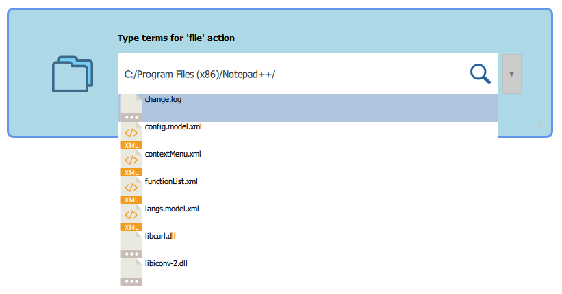

# **The Ultimate Desktop Launcher**
* Cross-platform
* Highly extensible/customizable
* Plugin-based architecture
* Online synchronization supported
* FOSS based

# How to build
## Windows
### Prerequisites
* Visual Studio 2015 or later
* Qt 5.7 or later

### Building
* make sure that `qmake` and `nmake` commands are available.
* run `script/build-windows.bat release`. To compile in debug mode, specify `debug` instead of `release`.
* if it succeeds, `output` directory will be created under the root of repository. 

## Linux
### Prerequisites
* Qt 5.7 or later

### Building
* make sure that `qmake` command is available.
* run `script/build-linux.sh`

# Translations
* [한글](docs/README.kor.md) 

# Screenshots

# License
[Mozilla Public License Version 2.0](https://www.mozilla.org/en-US/MPL/2.0/) 